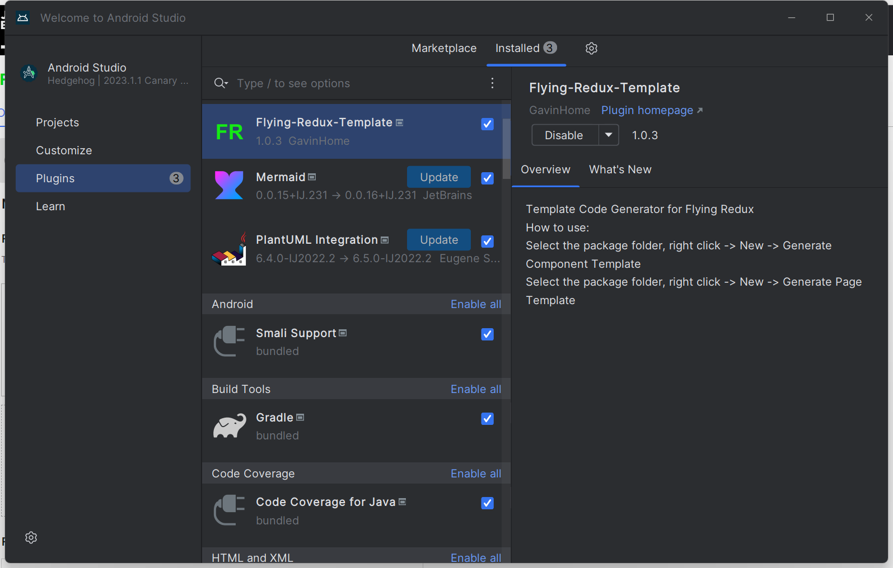
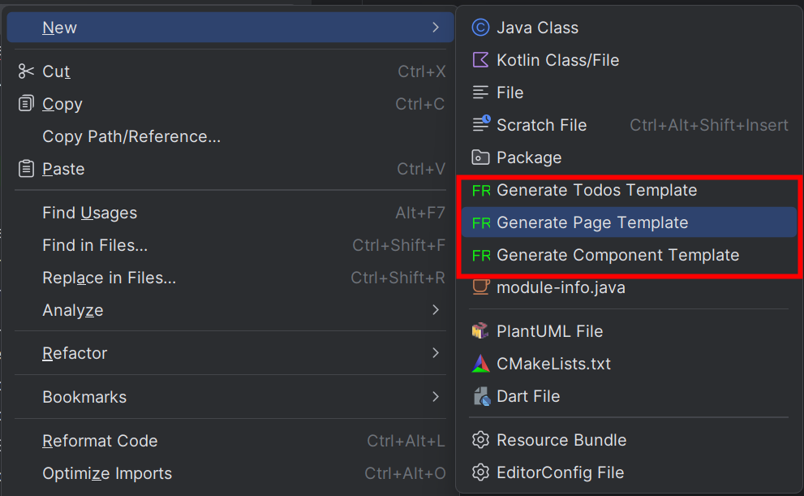

# flying-redux-template-for-as

Generate flying-redux Template for Android Studio. 

[Flying Redux](https://github.com/gavinhome/flying-redux) is an assembled flutter application framework based on Redux state management.

## Install

Search in plugin repositories and install

## How to use

### Step 1
Select your package and New->FishReduxTemplate

### Step 2
Choose your template and enter the module name

### Step 3
Enjoy yourself

## Template for VSCode

* [VSCode Support](https://github.com/GavinHome/flying-redux-template-for-vscode)